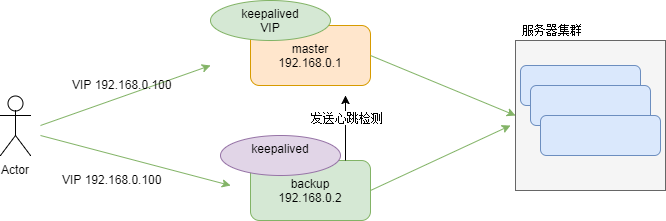

## Nginx

### Nginx介绍

 - http服务器，并发量5万
 
 - 虚拟主机
 
    1. 一台服务器可以部署多个应用，可以配置多个server节点，通过端口或者域名区分
    
            server {
                listen       81;
                server_name  localhost;
                location / {
                    root   html-81;
                    index  index.html index.htm;
                }
            }
 
 - 反向代理
 
    1. 正向代理：作为客户端的一个代理服务器，请求转发（网络）
    
    2. 反向代理：服务器网站的入口
             
             //配置集群
             upstream tomcat {
                server 192.168.25.148:8081;
             }
             server {
                 listen       81;
                 server_name  localhost;
                 location / {
                     proxy_pass   http://tomcat;
                     index  index.html index.htm;
                 }
             }
  
 
 - 负载均衡
            
             upstream tomcat {
                server 192.168.25.148:8081 weight=2;
                server 192.168.25.149:8082;
             }

### Nginx安装

 >[参考文档](nginx安装手册.doc)
 
 - 防火墙设置,开放端口
 
        vi /etc/sysconfig/iptables
        service iptables restart
        
### Nginx高可用

####keepalived

- 介绍:

    以VRRP协议(虚拟路由冗余协议)实现，将多个Nginx节点组成一个虚拟路由器组，
  
  包含一个master（主）和多个backup（备），主节点绑定一个VIP,备份节点会定时
  
  给主节点发送心跳检测，若主节点无响应，会将VIP绑定到备份节点，继续提供服务。
  
- 架构图

  
  
- Nginx实现高可用

    keepalived是通过检测keepalived进程是否存在实现主备切换的，所以当keepalived不存在时同时
    
    将Nginx进程也杀掉。
    
    
        #!/bin/bash
        # 如果进程中没有nginx则将keepalived进程kill掉
        A=`ps -C nginx --no-header |wc -l`      ## 查看是否有 nginx进程 把值赋给变量A 
        if [ $A -eq 0 ];then                    ## 如果没有进程值得为 零
               service keepalived stop          ## 则结束 keepalived 进程
        fi  
        
### 负载均衡技术

- DNS负载

   是域名系统，将IP和域名进行映射的数据库，一个IP可以对应多个域名，达到负载目的，使用UDP协议
    
   缺点：
        
     1. 负载均衡是平均分配的，对机器性能不能很好的分配；
     
     2. 单节点故障无法解决，当其中一个节点发送故障，还是会发送请求
     
- 四层负载

    基于网络传输层分发请求，是通过报文中的目标地址和端口，再加上负载均衡设备设置的服务器选择方式，
    
    决定最终选择的内部服务器与请求客户端建立TCP连接，如LVS、F5，性能高，支持多种网络协议；
    
    缺点：
    
     1. 对网络依赖较大，负载智能化方面没有7层负载好（比如不支持对url个性化负载）
     
- 七层负载

    基于应用层分发请求，通过报文中的真正有意义的应用层内容，再加上负载均衡设备设置的服务器选择方式，决定最终选择的服务器
    
    相当于一个代理服务器，与服务器进行三次握手建立TCP连接，如：Nginx
    
    缺点：
    
     1. 网络协议有限，nginx和apache支持http负载，性能没有4层负载高
     
- 架构

  基于4层负载+7层负载（LVS+Nginx）   
              
         

