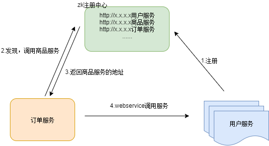
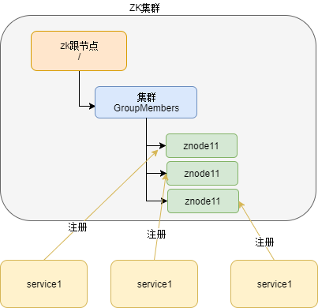
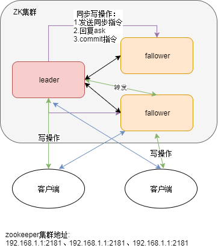

##e3商城v2.0
### SOA架构

####dubbo

* 定义

    1.系统之间的通信方式：
    
    Webservice：效率不高基于soap协议。
    
    使用restful形式的服务：http+json如果服务太多，服务之间调用关系混乱，需要治疗服务。
    
    使用dubbo。使用rpc协议进行远程调用，直接使用socket通信。传输效率高，并且可以统计出系统之间的调用关系、调用次数。
    
    2.系统架构演变：
    
    
    
    单一应用架构ORM：
    
    当网站流量很小时，只需一个应用，将所有功能都部署在一起，以减少部署节点和成本。
    
    垂直应用架构MVC： 
    
    当访问量逐渐增大，单一应用增加机器带来的加速度越来越小，将应用拆成互不相干的几个应用，以提升效率。
    
    分布式服务架构RPC：
     
    当垂直应用越来越多，应用之间交互不可避免，将核心业务抽取出来，作为独立的服务，逐渐形成稳定的服务中心，使前端应用能更快速的响应多变的市场需求。
    
    流动计算架构SOA：
     
    当服务越来越多，容量的评估，小服务资源的浪费等问题逐渐显现，此时需增加一个调度中心基于访问压力实时管理集群容量，提高集群利用率。
    
 
* dubbo架构

    
    
    1.节点角色说明：
    
    Provider: 暴露服务的服务提供方。
    
    Consumer: 调用远程服务的服务消费方。
    
    Registry: 服务注册与发现的注册中心。
    
    Monitor: 统计服务的调用次调和调用时间的监控中心。
    
    Container: 服务运行容器。
    
    2.调用关系说明：
    
    0. 服务容器负责启动，加载，运行服务提供者。
    
    1. 服务提供者在启动时，向注册中心注册自己提供的服务。
    
    2. 服务消费者在启动时，向注册中心订阅自己所需的服务。
    
    3. 注册中心返回服务提供者地址列表给消费者，如果有变更，注册中心将基于长连接推送变更数据给消费者。
    
    4. 服务消费者，从提供者地址列表中，基于软负载均衡算法，选一台提供者进行调用，如果调用失败，再选另一台调用。
    
    5. 服务消费者和提供者，在内存中累计调用次数和调用时间，定时每分钟发送一次统计数据到监控中心。
    
* dubbo其核心部分包含:

  1、远程通讯: 提供对多种基于长连接的NIO框架抽象封装，包括多种线程模型，序列化，以及“请求-响应”模式的信息交换方式。
  
  2、集群容错: 提供基于接口方法的透明远程过程调用，包括多协议支持，以及软负载均衡，失败容错，地址路由，动态配置等集群支持。
  
  3、自动发现: 基于注册中心目录服务，使服务消费方能动态的查找服务提供方，使地址透明，使服务提供方可以平滑增加或减少机器。
  
* Dubbo作用
  
  1、透明化的远程方法调用，就像调用本地方法一样调用远程方法，只需简单配置，没有任何API侵入。
  
  2、软负载均衡及容错机制，可在内网替代F5等硬件负载均衡器，降低成本，减少单点。
  
  3、 服务自动注册与发现，不再需要写死服务提供方地址，注册中心基于接口名查询服务提供者的IP地址，并且能够平滑添加或删除服务提供者。
  
  > dubbo就是资源调度和治理中心的管理工具
      
  >[参考文档](https://www.kancloud.cn/digest/javaframe/125576)    
    
#### 注册中心zk

* Zookeeper的介绍

    Zookeeper一个分布式的服务框架，是树型的目录服务的数据存储，能做到集群管理数据。
    
    Dubbo能与Zookeeper做到集群部署，当提供者出现断电等异常停机时，Zookeeper注册中心能自动删除提供者信息，当提供者重启时，能自动恢复注册数据。

    使用：
    
    1、可以作为集群的管理工具使用。
    
    2、可以集中管理配置文件。
    
* Zookeeper的安装

    1、解压缩tar
    
        tar -zxvf zookeeper-3.4.6.tar.gz
        
    2、创建data目录，主要是存储数据
    
    3、修改配置文件
    
        mv zoo_sample.cfg zoo.cfg
        
        查看zoo.cfg
        
        cat zoo.cfg |grep "^#"
        #心跳检测时间
        tickTime=2000     
        initLimit=10
        syncLimit=5
        #数据保存目录
        dataDir = /opt/aiwm/zookeeper-3.4.9_01_1/data
        #日志保存目录
        dataLogDir = /opt/aiwm/zookeeper-3.4.9_01_1/log
        clientPort=2181
        maxClientCnxns=1000
        #zk集群节点
        server.1=127.0.0.1:20022:20032
        server.2=127.0.0.1:20022:20032
        server.3=127.0.0.1:20022:20032
    
    4、启动服务
    
        cd bin
        #启动
        sh zkServer.sh start
        #停止
        sh  zkServer.sh stop
        #查看状态
        sh  zkServer.sh status
        
     >启动失败时，删除data目录下的zookeeper_server.pid文件
       
    5、开机自启和防火墙设置
    
        #关闭防火墙
        service iptables stop
        #将修改添加到配置文件，开机不启动防火墙
        chkconfig iptables off
        
        #开放2181端口
        /sbin/iptables -I INPUT -p tcp --dport 2181 -j ACCEPT
        #将修改永久保存到防火墙中
        /etc/rc.d/init.d/iptables save 
        
   -------------
   >[参考文档](https://www.cnblogs.com/felixzh/p/5869212.html)
   
* 实际应用场景

  1. 服务的注册与发现
    
    
  
  2. 配置中心
  
     分布式公共的文件配置
  
  3. 分布式锁
   
     顺序一致性，zk节点具有唯一性，当存在时不会在注册。
     
  4. 集群管理
  
    高可用、负载均衡   

* zk架构

    每个子目录项如NameService都被称作为znode，和文件系统一样，我们能够自由的增加、删除znode，在一个znode下增加、删除子znode，
    
    唯一的不同在于znode是可以存储数据的，数据结构为key-value类型
    
    1. 节点类型
    
        a. 持久化节点：zk与客户端断开连接后，该节点扔存在
        
        b. 顺序节点：zk断开连接后仍存在，会按顺序进行编号
        
        c. 临时节点：zk断开连接后删除该节点
        
        d. 临时顺序节点：zk断开连接删除节点，按顺序进行编号

      
    
* zk集群

    1. 架构
    
       
    
    2. 节点选举
    
        采用Zab协议，fast paxos选举算法。
    
    3. 数据同步
    
        保证数据一致性，写操作只能主节点操作，然后同步给从节点。
          
###zk+dubbo+spring     

* 发布服务
    
      <!-- 提供方应用信息，用于计算依赖关系 -->
      <dubbo:application name="e3-manager" />
      <dubbo:registry protocol="zookeeper" address="192.168.246.129:2181" />
      <!-- 用dubbo协议在20880端口暴露服务 -->
      dubbo:protocol name="dubbo" port="20880" />
    
      <!-- 声明需要暴露的服务接口 -->
      <dubbo:service interface="cn.e3mall.service.ItemService" ref="itemServiceImpl" timeout="600000"/>

* 消费服务

      <!-- 引用dubbo服务 -->
      <dubbo:application name="e3-manager-web"/>
      <dubbo:registry protocol="zookeeper" address="192.168.246.129:2181"/>
      <dubbo:reference interface="cn.e3mall.service.ItemService" id="itemService" />
        
        