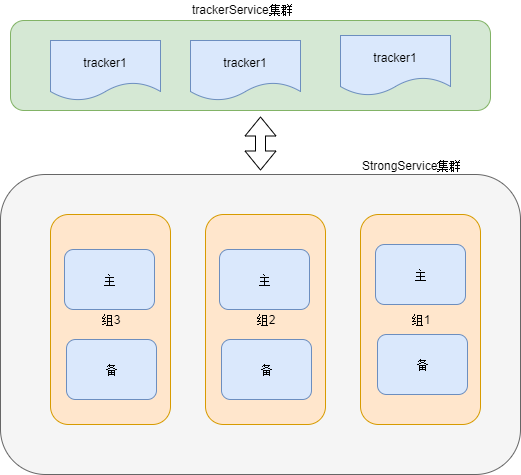
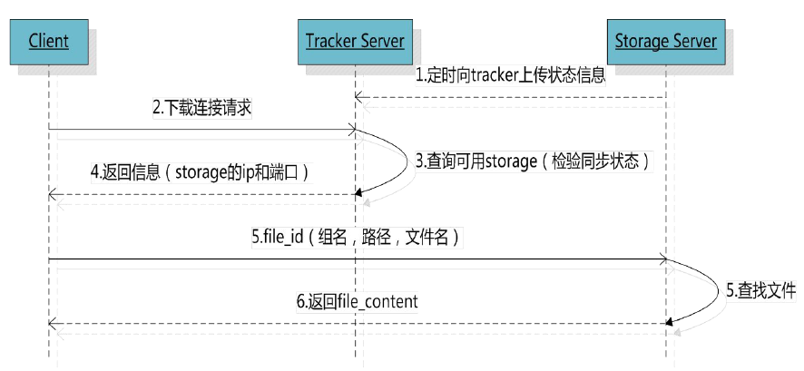

## 分布式文件系统

### fastDFS

- 简介

    实现了冗余备份、负载均衡、线性扩容机制
    
- 架构

   包含trackerService、storageService两部分
   
   1. trackerService：
   
       请求发送到trackerService，实现分发请求（负载均衡）到storage上；
       
       管理集群，获取每个storage集群的状态
       
   2. storage集群：真正存储文件的服务器
   
       包含多个组，每个组存储的内容不同，组内分为主备，存储的内容是相同的；
       
   
   
   
   
   
   
   
- 存储

    文件上传后返回的路径：组名，虚拟磁盘路径，数据两级目录，文件名
    
     group1 /M00 /02/04/ xss7ehSjsiee9.sh
     
- java客户端 

    1. 添加依赖
           
           <dependency>
               <groupId>commons-fileupload</groupId>
               <artifactId>commons-fileupload</artifactId>
               <version>${commons-fileupload.version}</version>
           </dependency>
           <dependency>
               <groupId>fastdfs_client</groupId>
               <artifactId>fastdfs_client</artifactId>
               <version>${fastdfs_client.version}</version>
           </dependency>
    
    2.使用
    
        1、加载配置文件，配置文件中的内容就是tracker服务的地址。
        配置文件内容：tracker_server=192.168.25.133:22122
        2、创建一个TrackerClient对象。直接new一个。
        3、使用TrackerClient对象创建连接，获得一个TrackerServer对象。
        4、创建一个StorageServer的引用，值为null
        5、创建一个StorageClient对象，需要两个参数TrackerServer对象、StorageServer的引用
        6、使用StorageClient对象上传图片。
        7、返回数组。包含组名和图片的路径。
     
     
        