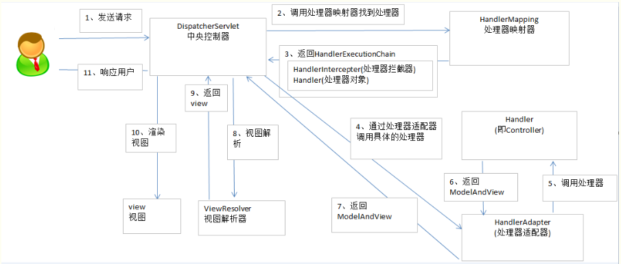
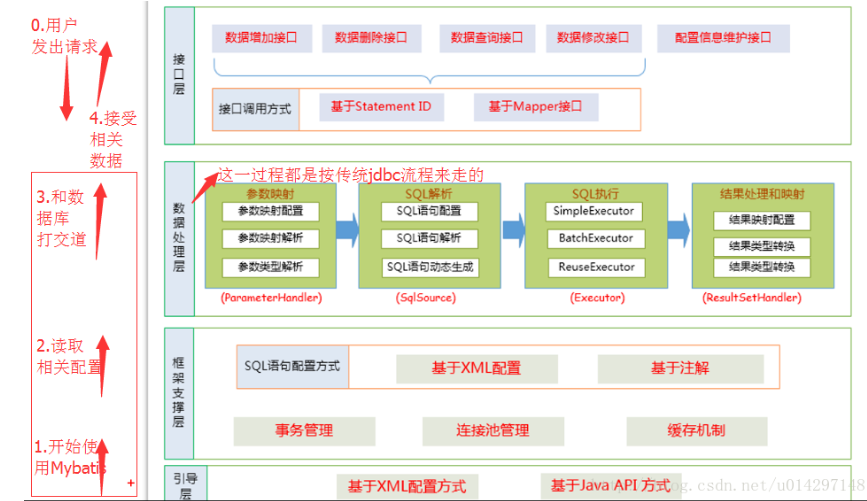
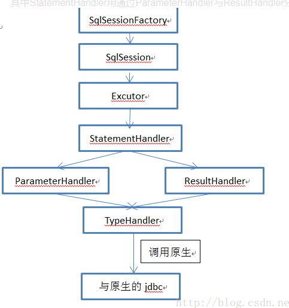

## SSM框架

###springMVC

* 架构图

* 组件说明
    
    springmvc.xml文件：
    
        <!--扫描控制器-->
        	<context:component-scan base-package="cn.e3mall.controller" />
        	<!--会自动注册DefaultAnnotationHandlerMapping与AnnotationMethodHandlerAdapter 两个bean,是spring MVC为@Controllers分发请求所必须的。
            并提供了：数据绑定支持，@NumberFormatannotation支持，@DateTimeFormat支持，@Valid支持，读写XML的支持（JAXB），读写JSON的支持（Jackson）。-->
            <mvc:annotation-driven />
        	<!--视图解析器-->
        	<bean
        		class="org.springframework.web.servlet.view.InternalResourceViewResolver">
        		<property name="prefix" value="/WEB-INF/jsp/" />
        		<property name="suffix" value=".jsp" />
        	</bean>
        
            <!-- 对静态资源文件的访问  方案一 （二选一） -->
            <mvc:default-servlet-handler/>
            
            <!-- 对静态资源文件的访问  方案二 （二选一）-->
            <!--<mvc:resources mapping="/images/**" location="/images/" cache-period="31556926"/>-->
            <!--<mvc:resources mapping="/js/**" location="/js/" cache-period="31556926"/>-->
            <!--<mvc:resources mapping="/css/**" location="/css/" cache-period="31556926"/>-->
    	
    在web.xml中配置：
    <!-- springmvc的前端控制器 -->
    	<servlet>
    		<servlet-name>e3-manager</servlet-name>
    		<servlet-class>org.springframework.web.servlet.DispatcherServlet</servlet-class>
    		<!-- contextConfigLocation不是必须的， 如果不配置contextConfigLocation， springmvc的配置文件默认在：WEB-INF/servlet的name+"-servlet.xml" -->
    		<init-param>
    			<param-name>contextConfigLocation</param-name>
    			<param-value>classpath:spring/springmvc.xml</param-value>
    		</init-param>
    		<load-on-startup>1</load-on-startup>
    	</servlet>
    	<!--
        1、拦截*.do、*.htm， 例如：/user/add.do
            这是最传统的方式，最简单也最实用。不会导致静态文件（jpg,js,css）被拦截。
        2、拦截/，例如：/user/add
            可以实现现在很流行的REST风格，不会拦截jsp，但会导致静态文件（jpg,js,css）被拦截后不能正常显示。
        3、拦截/*，这是一个错误的方式，请求可以走到Action中，但转到jsp时再次被拦截，不能访问到jsp。
        -->
        <servlet-mapping>
            <servlet-name>e3-manager</servlet-name>
            <url-pattern>/</url-pattern>
        </servlet-mapping>
    
* 流程解析

    1.用户发送请求至 前端控制器DispatcherServlet。

    2.前端控制器DispatcherServlet收到请求后调用处理器映射器HandlerMapping。

    3.处理器映射器HandlerMapping根据请求的Url找到具体的处理器，生成处理器对象Handler及处理器拦截器HandlerIntercepter（如果有则生成）一并返回给前端控制器DispatcherServlet。

    4.前端控制器DispatcherServlet通过处理器适配器HandlerAdapter调用处理器Controller。

    5.执行处理器（Controller，也叫后端控制器）
    
    6.处理器Controller执行完后返回ModelAnView。
    
    7.处理器映射器HandlerAdapter将处理器Controller执行返回的结果ModelAndView返回给前端控制器DispatcherServlet。
    
    8.前端控制器DispatcherServlet将ModelAnView传给视图解析器ViewResolver。
    
    9.视图解析器ViewResolver解析后返回具体的视图View。
    
    10.前端控制器DispatcherServlet对视图View进行渲染视图（即：将模型数据填充至视图中）
    
    11.前端控制器DispatcherServlet响应用户。
 
 * 参考
    
    https://www.cnblogs.com/sunniest/p/4555801.html
    https://www.cnblogs.com/baiduligang/p/4247164.html
    
###mybatis

   MyBatis 是支持定制化 SQL、存储过程以及高级映射的优秀的持久层框架，其主要就完成2件事情：

   1.封装JDBC操作
   
   2.利用反射打通Java类与SQL语句之间的相互转换
   
* 架构图
   
   
   
   
   
* 与数据库交互方式
 
   a.使用传统的MyBatis提供的API；
 
   b. 使用Mapper接口
* 参考

   https://blog.csdn.net/luanlouis/article/details/40422941